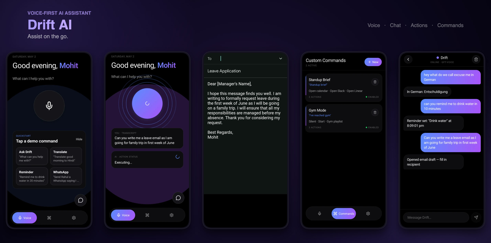

# Drift AI

**Voice-first AI assistant for iOS & Android.**
Speak naturally — Drif resolves your intent into real actions. Powered by OpenAI.

---

## Tech Stack

| | |
|---|---|
| React Native | 0.85.2 (New Architecture) |
| React | 19.2.3 |
| TypeScript | 5.8.3 |
| State | Zustand |
| Storage | react-native-mmkv + Keychain (API key) |
| Navigation | React Navigation v7 (stack + custom tab bar) |
| AI | OpenAI gpt-3.5-turbo via Axios |
| Native STT | Android SpeechRecognizer (Kotlin bridge) |
| Notifications | Notifee |

---

## Features

### 1. WhatsApp Messaging
Voice → intent → contact resolution → prefilled WhatsApp chat.
> _"Send Sahil a happy birthday text"_ — fetches contact, drafts the message, opens WhatsApp.

### 2. Email Draft
LLM-generated subject + body → opens Gmail with a prefilled draft.
> _"Draft a leave email for 5th May, going on a family trip"_ — writes the leave request with reason and regards, resolves recipient from contacts, opens Gmail.

### 3. Instagram Smart Post
Picks latest gallery image → generates caption + hashtags → opens Instagram via share sheet. Caption is auto-copied to clipboard for pasting.
> _"Post my recent picture on Instagram"_ — selects latest photo, writes caption, opens Instagram for feed or reels.

### 4. AI Translation
Translates spoken or typed text, displays the result, and reads it aloud via TTS.
> _"How do you say 'excuse me' in Italian?"_ — translates, speaks, and displays the result.

### 5. Call Contact
Resolves contact name → triggers phone call intent.
> _"Call Ram"_ — fetches contact and starts the call.

### 6. Events & Reminders
Creates local notifications (Notifee) or calendar events at a scheduled time.
> _"Remind me to drink water"_ — notifies every 4 hours for 24 hours.
> _"Set a reminder to wish Rohan happy birthday on 11th May"_ — creates calendar event with notification.

### 7. Voice AI Chat
Ask anything — Drif responds via OpenAI and optionally reads the answer aloud.
> _"What's the weather like?"_ — conversational Q&A with TTS playback.

### 8. Smart Gallery Search
Navigates the gallery to photos from a specific date.
> _"Show me photos from 24th Feb"_ — opens gallery filtered to that date.

### 9. Custom Commands
User-defined trigger phrases mapped to multi-step action chains (open app, send message, set timer, play, etc.). Stored locally via MMKV.
> _"Standup brief"_ — opens Calendar, Slack, and Linear in sequence.

### 10. Multi-step Execution
Compound commands parsed and executed as sequential actions with state carried across steps — same engine that powers Custom Commands.

---

## App Flow — Under the Hood

```
User speaks
    │
    ▼
[SpeechRecognizerModule.kt]          ← Kotlin native module, Android SpeechRecognizer API
    │  NativeEventEmitter events:
    │  onSpeechStart / onSpeechRecognized / onSpeechError / onSpeechEnd
    ▼
[useVoice hook]                      ← requests RECORD_AUDIO permission on first use
    │  transcript string
    ▼
[HomeScreen]                         ← useMicCycle drives idle→listening→processing→responding states
    │  sends transcript as user message
    ▼
[useAppStore.addMessage]             ← persists message to MMKV
    │
    ▼
[openaiClient.createChatCompletion]  ← POST /chat/completions with Bearer apiKey header
    │  model: gpt-3.5-turbo
    │  temperature: 0.7, max_tokens: 2048
    │  supports JSON response_format and image_url content blocks
    ▼
[axiosClient]                        ← base URL: https://api.openai.com/v1, 30s timeout
    │  in-memory GET cache (5-min TTL, keyed by URL)
    ▼
[Intent resolution]
    │  WhatsApp → deep link with prefilled message
    │  Email    → Gmail intent with subject + body
    │  Instagram→ react-native-share share sheet
    │  Call     → phone call intent via contacts
    │  Reminder → Notifee local notification / calendar event
    │  Gallery  → date-filtered navigation
    │  TTS      → text-to-speech playback of response
    ▼
[useAppStore.addMessage (AI role)]   ← persists AI reply, updates commandCount
    │
    ▼
UI updates (ChatScreen / HomeScreen response card)
```

---

## State & Storage

All global state lives in a single Zustand store ([src/store/useAppStore.ts](src/store/useAppStore.ts)).

| Key | Storage | Notes |
|---|---|---|
| `apiKey` | Keychain (via `apiKeyStorage`) | Migrates from MMKV on first load |
| `commands` | MMKV `commands` | Persisted on every upsert/delete/toggle |
| `messages` | MMKV `messages` | Persisted on every addMessage/clear |
| `permissions` | MMKV `permissions` | Persisted on toggle |
| `user.name` | MMKV `user_name` | Persisted on setName |
| `commandCount` | MMKV `command_count` | Incremented per user message |
| `theme`, `vizStyle`, `responseStyle`, `language`, `ttsEnabled` | In-memory only | Reset on restart |

API key hydration sequence on app init:
1. Try Keychain first
2. Fall back to MMKV (legacy)
3. If found in MMKV, migrate to Keychain and remove from MMKV
4. Set `apiKeyHydrated: true` — screens gate on this before making API calls

---

## Project Structure

```
DriftAI/
├── App.tsx                          # GestureHandlerRootView → SafeAreaProvider → RootNavigator
├── src/
│   ├── store/useAppStore.ts         # Single Zustand store — all state + persistence
│   ├── theme/tokens.ts              # Design tokens: dark + light, radii, spacing, fonts
│   ├── navigation/RootNavigator.tsx # Stack + custom floating tab bar (60px pill, bottom: 22)
│   ├── screens/
│   │   ├── HomeScreen.tsx           # Voice tab — mic, quick actions, transcript/response
│   │   ├── ChatScreen.tsx           # Full chat history — gradient user bubbles, AI bubbles
│   │   ├── CommandsScreen.tsx       # Commands list + create/edit bottom sheet modal
│   │   └── SettingsScreen.tsx       # Permissions, AI style, theme, profile, API key
│   ├── components/
│   │   ├── MicButton.tsx            # 132px mic — 3 viz modes: rings / orb / bars
│   │   ├── GradientText.tsx         # MaskedView + LinearGradient text fill
│   │   ├── Chip.tsx                 # Pill pressable for quick-action chips
│   │   ├── Toggle.tsx               # Animated iOS-style toggle
│   │   ├── MonoLabel.tsx            # Uppercase monospace dim label
│   │   └── TypingDots.tsx           # Staggered 3-dot bounce animation
│   ├── hooks/
│   │   ├── useVoice.ts              # Native Android STT bridge + permission flow
│   │   ├── useMicCycle.ts           # Demo state machine (idle→listening→processing→responding)
│   │   ├── useThemeTokens.ts        # Resolves dark/light token set from store
│   │   ├── useImagePicker.ts        # Camera + gallery picker (react-native-image-picker)
│   │   ├── useContacts.ts           # Contacts with permission handling
│   │   ├── useNotifications.ts      # Notifee — instant + scheduled notifications
│   │   └── useShare.ts             # react-native-share wrapper
│   └── utils/
│       ├── api/axiosClient.ts       # Axios, 30s timeout, 5-min GET cache
│       ├── api/openaiClient.ts      # createChatCompletion, getOpenAIModels
│       └── storage/
│           ├── mmkvStorage.ts       # Typed MMKV helpers (get/set/remove/clear/keys)
│           └── apiKeyStorage.ts     # Keychain read/write/delete for OpenAI key
└── android/app/src/main/java/com/driftai/
    ├── SpeechRecognizerModule.kt    # startListening / stopListening, emits 4 events
    ├── SpeechRecognizerPackage.kt   # Registers module with RN
    └── MainApplication.kt          # Adds SpeechRecognizerPackage to package list
```

---

## Design System

Dark-first, two token sets resolved at runtime by `useThemeTokens()`.

```
bg:            #000000
surface:       #0c0c0e
surface2:      #141418
surface3:      #1c1c22
accent1:       #5B8CFF   (electric blue)
accent2:       #A855F7   (violet)
accentGradient: ['#5B8CFF', '#A855F7']
text:          #f5f5f7
textDim:       rgba(245,245,247,0.6)
danger:        #FF5D5D
online:        #22C55E

Fonts:  Inter (sans), JetBrainsMono (mono)
Radii:  sm:8  md:14  lg:18  xl:22  pill:999
Space:  n × 8px
```

MicButton visualizer modes (set per-user in Settings):
- **rings** — 3 expanding/fading concentric rings, staggered 700ms, 2100ms cycle
- **orb** — 2 overlapping blobs (accent1 + accent2) at different oscillation speeds
- **bars** — 28 radial bars at equal angles, sequential wave animation

---

## Configuration

The only required config is an OpenAI API key. Add it in **Settings → API Key**. It is stored in the device Keychain and never leaves the device except in OpenAI API requests.

```
Base URL:     https://api.openai.com/v1
Model:        gpt-3.5-turbo
Temperature:  0.7
Max tokens:   2048
```
